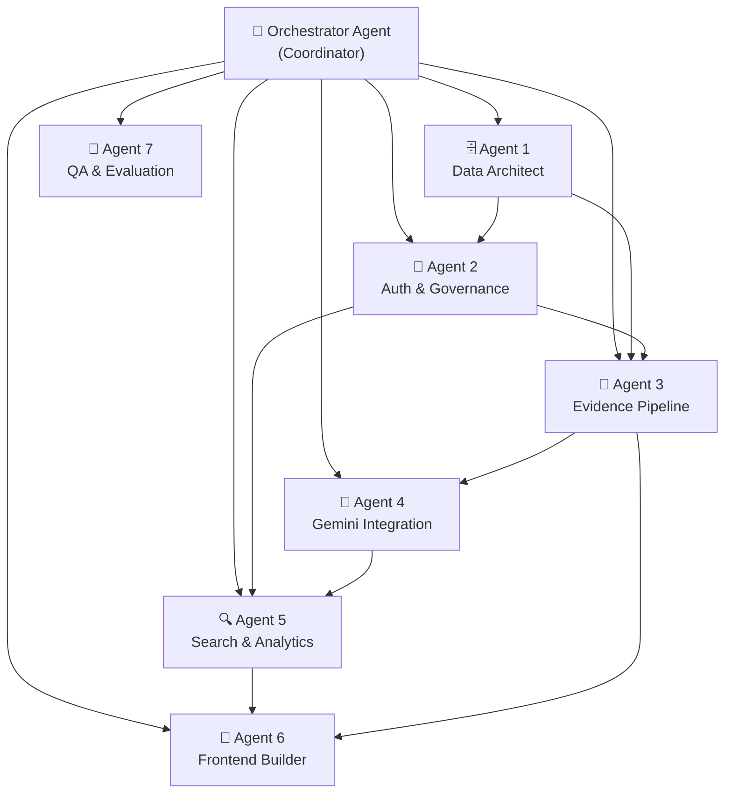

# SkillPulse: Multi-Agent Implementation Plan

## 🎯 The Big Picture

Build SkillPulse using a **team of 7 specialized custom AI agents**, each owning a distinct domain of the platform. These agents work together through well-defined interfaces, coordinated by an **Orchestrator Agent** that sequences work, resolves cross-agent dependencies, and ensures the final product is cohesive.



---

## 🏗️ Architecture Overview

### Tech Stack (Recommended for MVP)

| Layer | Technology | Rationale |
|---|---|---|
| **Frontend** | Next.js 15+ (React) | SSR, API routes, strong typing with TypeScript |
| **Backend API** | Next.js API Routes + tRPC or REST | Collocated with frontend, type-safe |
| **Database** | PostgreSQL + Prisma ORM | Relational model fits the evidence graph; Prisma gives type-safe queries |
| **Auth** | NextAuth.js / Auth.js | Role-based access, SSO-ready, session management |
| **AI** | Gemini 3.8 Flash API (server-side) | Structured extraction, query parsing |
| **File Storage** | Local filesystem / S3-compatible (MinIO for dev) | Private evidence file storage |
| **Search** | PostgreSQL full-text search (MVP) → Meilisearch (later) | Start simple, scale later |

---

## 🤖 The 7 Custom Agents — Detailed Breakdown

---

### Agent 0: 🧠 **Orchestrator Agent** (The Coordinator)

> **Role:** Sequences the other 6 agents, manages dependencies, resolves conflicts, and ensures integration.

**What it does:**
- Defines the build order and dependency graph
- Creates shared contracts (TypeScript interfaces, API schemas) before agents start
- Reviews outputs from each agent for compatibility
- Triggers integration testing after each agent completes
- Manages the project-wide configuration (`env`, `prisma schema`, `package.json`)

**Implementation approach:**
This is YOU (the human + Antigravity) acting as the orchestrator. You invoke each specialized agent (via `/goal` or subagent prompts) with precise instructions, shared context, and interface contracts.

```
Build Order:
━━━━━━━━━━━━━━━━━━━━━━━━━━━━━━━━━━━━━━━━━━
Phase 1 ─── Agent 1 (Data Architect)        ← Foundation
Phase 2 ─── Agent 2 (Auth & Governance)     ← Depends on schema
Phase 3 ─┬─ Agent 3 (Evidence Pipeline)     ← Parallel
          └─ Agent 4 (Gemini Integration)   ← Parallel
Phase 4 ─── Agent 5 (Search & Analytics)    ← Depends on 3+4
Phase 5 ─── Agent 6 (Frontend Builder)      ← Depends on all APIs
Phase 6 ─── Agent 7 (QA & Evaluation)       ← End-to-end validation
━━━━━━━━━━━━━━━━━━━━━━━━━━━━━━━━━━━━━━━━━━━
```

---

### Agent 1: 🗄️ **Data Architect Agent**

> **Role:** Designs and implements the entire database schema, seed data, and data access layer.

#### Responsibilities

| Task | Details |
|---|---|
| **Schema Design** | Create the full Prisma schema with all 25+ core entities from the research doc |
| **Relationships** | University → College → Department → Program → Cohort hierarchy; Student ↔ Evidence ↔ Skills graph |
| **Provenance Fields** | Every record gets: `sourceType`, `sourceId`, `createdAt`, `updatedAt`, `importedAt`, `visibilityScope`, `lifecycleState` |
| **Seed Data** | Generate realistic demo data: 2 colleges, 4 departments, 50 students, 200 evidence items, 100 skills |
| **Migration System** | Prisma migrations, rollback strategy |
| **Data Access Layer** | Type-safe repository pattern for each entity |

#### Core Entities This Agent Creates

```prisma
// Simplified view of key models

model University {
  id        String    @id @default(cuid())
  name      String
  colleges  College[]
}

model College {
  id           String       @id @default(cuid())
  universityId String
  departments  Department[]
}

model Student {
  id             String          @id @default(cuid())
  userId         String          @unique
  departmentId   String
  enrollmentNo   String          @unique
  profile        StudentProfile?
  evidenceItems  EvidenceItem[]
  skillClaims    SkillClaim[]
  careerProfile  CareerProfile?
}

model EvidenceItem {
  id            String   @id @default(cuid())
  studentId     String
  type          EvidenceType  // PROJECT, CERTIFICATE, ACHIEVEMENT, ACTIVITY, PUBLICATION
  title         String
  description   String?
  dateObtained  DateTime
  issuerName    String?
  fileUrl       String?
  externalUrl   String?
  sourceType    SourceType  // STUDENT_SUBMITTED, UNIVERSITY_SYSTEM, ISSUER_VERIFIED, REVIEWER_APPROVED, AI_SUGGESTED
  workflowState WorkflowState  // DRAFT, SUBMITTED, PENDING_REVIEW, APPROVED, REJECTED, NEEDS_CLARIFICATION, REVOKED, EXPIRED
  skillClaims   SkillClaim[]
  reviews       VerificationAction[]
}

model Skill {
  id           String       @id @default(cuid())
  canonicalLabel String     @unique
  category     String
  definition   String?
  aliases      SkillAlias[]
  claims       SkillClaim[]
}

model SkillClaim {
  id           String   @id @default(cuid())
  studentId    String
  skillId      String
  evidenceId   String?
  sourceType   SourceType
  isAiSuggested Boolean @default(false)
  confirmedByStudent Boolean @default(false)
  freshness    DateTime?
}

model VerificationAction {
  id          String   @id @default(cuid())
  evidenceId  String
  reviewerId  String
  decision    ReviewDecision  // APPROVED, REJECTED, NEEDS_CLARIFICATION
  reason      String
  reviewedAt  DateTime @default(now())
}
```

#### Deliverables
- [x] `prisma/schema.prisma` — Complete schema
- [x] `prisma/seed.ts` — Realistic demo data generator
- [x] `src/lib/db/` — Repository pattern data access layer
- [x] `src/types/` — Shared TypeScript types/enums

#### Success Criteria
- All 25+ entities from Section 9.2 of the research doc are modeled
- Every record has provenance fields (source, timestamps, visibility, state)
- Hierarchy enforced: University → College → Department → Program
- Demo seed creates a realistic multi-college dataset
- Schema passes validation and generates clean migrations

---

### Agent 2: 🔐 **Auth & Governance Agent**

> **Role:** Implements authentication, role-based access control (RBAC), college-scoped permissions, audit logging, and privacy controls.

#### Responsibilities

| Task | Details |
|---|---|
| **Authentication** | NextAuth.js with credential provider (MVP); SSO-ready architecture |
| **Role System** | 6 roles: `STUDENT`, `FACULTY_REVIEWER`, `DEPT_ADMIN`, `UNIVERSITY_ADMIN`, `PLACEMENT_STAFF`, `PARTNER` |
| **Scope Enforcement** | Every API call checks: role + college/department scope. A dept admin in College A cannot see College B students |
| **Audit Logging** | Log every sensitive action: review decision, search, export, sharing, data access |
| **Privacy Controls** | Student visibility settings per evidence item; external sharing with expiry/revocation |
| **Middleware** | Server-side auth middleware that injects user context + scope into every request |

#### Role-Permission Matrix

```
┌────────────────────┬──────┬──────────┬──────────┬──────────┬───────────┬─────────┐
│ Action             │ STU  │ FACULTY  │ DEPT_ADM │ UNI_ADM  │ PLACEMENT │ PARTNER │
├────────────────────┼──────┼──────────┼──────────┼──────────┼───────────┼─────────┤
│ Submit evidence    │  ✅  │    ❌    │    ❌    │    ❌    │     ❌    │   ❌   │
│ Edit own profile   │  ✅  │    ❌    │    ❌    │    ❌    │     ❌    │   ❌   │
│ Review evidence    │  ❌  │    ✅    │    ✅    │    ✅    │     ❌    │   ❌   │
│ Search students    │  ❌  │  Dept    │  Dept    │  All     │   Opt-in  │ Shared  │
│ View aggregates    │  ❌  │  Dept    │  Dept    │  All     │   Opt-in  │   ❌   │
│ Manage taxonomy    │  ❌  │    ❌    │    ✅    │    ✅    │     ❌    │   ❌   │
│ Export data        │  Own │    ❌    │  Dept    │  All     │     ❌    │   ❌   │
│ View CGPA/attend.  │  Own │  Dept    │  Dept    │  Scope   │     ❌    │   ❌   │
│ Share externally   │  ✅  │    ❌    │    ❌    │    ❌    │     ❌    │   ❌   │
└────────────────────┴──────┴──────────┴──────────┴──────────┴───────────┴─────────┘
```

#### Deliverables
- [x] `src/lib/auth/` — NextAuth config, session types, role types
- [x] `src/middleware.ts` — Route protection + scope injection
- [x] `src/lib/auth/rbac.ts` — Permission checker with scope validation
- [x] `src/lib/audit/` — Audit event logger
- [x] `src/app/api/auth/` — Auth API routes
- [x] Login/registration pages with role selection

#### Success Criteria
- No API endpoint returns data outside the user's authorized scope
- Every review, search, export, and sharing action is logged
- Students can set per-item visibility (private, department, university, shared)
- Demo login works for all 6 roles with pre-seeded accounts

---

### Agent 3: 📄 **Evidence Pipeline Agent**

> **Role:** Builds the complete evidence submission → review → approval workflow.

#### Responsibilities

| Task | Details |
|---|---|
| **Submission Flow** | Student uploads project/certificate/achievement with structured form |
| **File Handling** | Upload, validate (type/size), store privately, generate time-bound access URLs |
| **Workflow Engine** | State machine: Draft → Submitted → Pending Review → Approved/Rejected/Needs Clarification |
| **Review Queue** | Faculty sees scoped queue sorted by date; can approve/reject/clarify with mandatory reason |
| **Correction Flow** | Student can edit rejected items and resubmit; reviewer sees history |
| **Provenance Tracking** | Every state change recorded with who/when/why |

#### State Machine

```
                    ┌──────────────────────────────────────────┐
                    │                                          │
    ┌───────┐   ┌───┴────┐   ┌─────────────┐   ┌──────────┐  │
    │ DRAFT ├──►│SUBMITTED├──►│PENDING_REVIEW├──►│ APPROVED │  │
    └───────┘   └────────┘   └──────┬───────┘   └──────────┘  │
                                    │                          │
                              ┌─────▼──────┐                   │
                              │  REJECTED  ├───────────────────┘
                              └─────┬──────┘     (student corrects
                                    │             & resubmits)
                              ┌─────▼──────────────┐
                              │NEEDS_CLARIFICATION │
                              └────────────────────┘
```

#### API Endpoints

```
POST   /api/evidence              — Submit new evidence
GET    /api/evidence/:id          — Get evidence details (scoped)
PATCH  /api/evidence/:id          — Update (only if DRAFT or REJECTED)
DELETE /api/evidence/:id          — Soft delete (audit trail)
POST   /api/evidence/:id/submit   — Move from DRAFT to SUBMITTED
GET    /api/review/queue          — Get reviewer's pending items (scoped)
POST   /api/review/:id/decide     — Approve/Reject/Clarify with reason
GET    /api/evidence/:id/history  — Full provenance trail
POST   /api/evidence/:id/upload   — File upload endpoint
```

#### Deliverables
- [x] `src/lib/evidence/` — Evidence service, state machine, file handler
- [x] `src/app/api/evidence/` — All evidence API routes
- [x] `src/app/api/review/` — Review queue and decision API routes
- [x] Evidence submission form components
- [x] Review queue UI components
- [x] Provenance timeline component

#### Success Criteria
- A student can submit a project with file + metadata
- Workflow state transitions are enforced (can't skip states)
- Reviewer sees only their scoped items
- Every state change has a provenance record (who, when, why)
- Files are validated and stored privately
- Rejected items show reason and allow correction + resubmission

---

### Agent 4: 🤖 **Gemini Integration Agent**

> **Role:** Implements all AI-assisted features using Gemini, with strict safety boundaries.

#### Responsibilities

| Task | Details |
|---|---|
| **Metadata Extraction** | When evidence is submitted, extract: title, issuer, date, technologies, candidate skills |
| **Skill Mapping** | Map extracted free-text skills to canonical skill IDs in the taxonomy |
| **Project Summarization** | Generate a concise summary for student confirmation |
| **Query Parsing** | Convert natural-language search ("students who know React and have a verified ML project") into structured query |
| **Safety Boundary** | ALL outputs are suggestions only; never auto-approve; student/reviewer confirmation required |
| **Schema Validation** | Gemini output must match a strict JSON schema; reject malformed responses |

#### Architecture

```
┌─────────────────────────────────────────────────────────────┐
│                    SAFETY BOUNDARY                          │
│                                                             │
│  Evidence File ──► Gemini API ──► Raw JSON ──► Validate ──► │
│                    (server-side)   (candidate)  (schema)     │
│                                                             │
│  ──► Taxonomy Lookup ──► Student Correction ──► Reviewer ──►│
│      (deterministic)     (human confirms)       (human)     │
│                                                             │
│  ──► Stored as CONFIRMED data with provenance               │
└─────────────────────────────────────────────────────────────┘
```

#### Gemini Prompts (Server-Side Only)

```typescript
// Example: Evidence extraction prompt
const EXTRACTION_PROMPT = `
You are analyzing a student's evidence submission for a university talent platform.

Extract the following from the provided text/document:
- title: string
- issuer_or_organizer: string | null
- date_obtained: ISO date string | null
- technologies: string[]
- candidate_skills: string[]  (match from provided skill catalog)
- summary: string (2-3 sentences)
- confidence: "high" | "medium" | "low"

RULES:
- Only extract information explicitly present in the document
- Do NOT infer skills not mentioned or demonstrated
- Do NOT assess proficiency level
- Do NOT make claims about the student's character or ability
- If uncertain, set confidence to "low" and include in "uncertain_fields"

Respond ONLY with valid JSON matching this schema.

SKILL CATALOG (match skills to these canonical labels):
${skillCatalogJson}

EVIDENCE TEXT:
${evidenceContent}
`;
```

#### Deliverables
- [x] `src/lib/gemini/` — Gemini client, prompt templates, schema validators
- [x] `src/lib/gemini/extraction.ts` — Evidence metadata extraction
- [x] `src/lib/gemini/skill-mapping.ts` — Free-text to canonical skill mapper
- [x] `src/lib/gemini/query-parser.ts` — Natural language to structured query
- [x] `src/lib/gemini/summarizer.ts` — Project summary generator
- [x] `src/app/api/ai/` — AI API routes (server-side only)
- [x] UI for showing AI suggestions with confirm/reject controls

#### Success Criteria
- Gemini API key is server-side only, never exposed to client
- Every AI output is clearly labeled "AI Suggestion" in the UI
- Student can accept, modify, or reject each suggestion individually
- Invalid/malformed Gemini responses are caught and gracefully handled
- Extraction matches canonical skill IDs from the taxonomy
- No AI output auto-populates a "verified" or "approved" field

---

### Agent 5: 🔍 **Search & Analytics Agent**

> **Role:** Builds the explainable search engine and coverage-aware analytics dashboards.

#### Responsibilities

| Task | Details |
|---|---|
| **Structured Search** | Multi-filter search: skills, evidence type, college, department, workflow state, date range |
| **NL Search** | Natural language queries parsed by Gemini (Agent 4) into structured filters |
| **Explainable Results** | Every match shows WHY: "Matched because: ✅ React (approved project), ✅ ML (verified certificate)" |
| **Scope Enforcement** | Results never include students outside the searcher's authorized scope |
| **Coverage Analytics** | Show counts WITH denominators: "45 of 120 students have ≥1 approved evidence item" |
| **Aggregates** | Skills distribution, evidence status breakdown, review queue metrics — always with coverage context |

#### Search Result Schema

```typescript
interface SearchResult {
  student: {
    id: string;
    name: string;
    department: string;
    college: string;
  };
  matchedCriteria: {
    criterion: string;          // "React"
    matched: boolean;
    evidenceType: string;       // "Approved Project"
    evidenceTitle: string;      // "E-commerce Platform"
    evidenceDate: string;
    provenanceLevel: string;    // "reviewer_approved"
  }[];
  unmatchedCriteria: string[];  // Skills searched but not found
  notConsidered: string[];      // Fields outside search scope
  coverageNote: string;         // "Profile has 3 of 5 sections populated"
}
```

#### Dashboard Widgets

```
┌─────────────────────────────────────────────────────┐
│  📊 Department Skill Coverage                       │
│                                                     │
│  React:     ████████░░░░  45/120 students (37.5%)   │
│  Python:    ██████████░░  82/120 students (68.3%)   │
│  ML/AI:     ████░░░░░░░░  28/120 students (23.3%)   │
│                                                     │
│  ⚠️ Coverage: 95/120 students have ≥1 evidence item │
│  📅 Period: Sep 2025 - Sep 2026                     │
│  🏫 Scope: Computer Science, College A              │
└─────────────────────────────────────────────────────┘
```

#### Deliverables
- [x] `src/lib/search/` — Search engine, query builder, result formatter
- [x] `src/app/api/search/` — Search API with scope enforcement
- [x] `src/app/api/analytics/` — Aggregate endpoints with coverage
- [x] Search UI with filters + NL input + explainable results
- [x] Analytics dashboard with coverage-aware charts

#### Success Criteria
- Search never returns results outside the user's scope
- Every result explains WHY it matched (evidence + provenance)
- Aggregates always show numerator, denominator, and coverage %
- NL queries are correctly parsed into structured filters
- "Not evidenced" is shown instead of "does not have this skill"

---

### Agent 6: 🎨 **Frontend Builder Agent**

> **Role:** Builds the complete web application UI — polished, responsive, role-aware.

#### Responsibilities

| Task | Details |
|---|---|
| **Design System** | Dark mode, modern typography (Inter), glassmorphism, micro-animations |
| **Role-Based Views** | Different layouts/navigation for each role |
| **Student Dashboard** | Profile, evidence list, skill graph, career pathway, sharing controls |
| **Reviewer Dashboard** | Review queue, decision interface, provenance timeline |
| **Admin Dashboard** | Analytics, coverage charts, taxonomy management, user management |
| **Search Interface** | Multi-filter + NL search with explainable results |
| **Evidence Forms** | Dynamic forms for projects, certificates, achievements with file upload |
| **AI Suggestion UI** | Clear "AI suggests..." cards with accept/modify/reject controls |

#### Key Pages

```
/                          → Landing / login
/dashboard                 → Role-based dashboard redirect
/student/profile           → Student's evidence-linked profile
/student/evidence/new      → Submit new evidence
/student/evidence/:id      → View evidence detail + provenance
/student/skills            → Skill map with evidence links
/student/career            → Career pathway + gap analysis
/student/passport          → Shareable talent passport builder
/reviewer/queue            → Review queue (scoped)
/reviewer/evidence/:id     → Review decision interface
/admin/analytics           → Coverage-aware analytics
/admin/taxonomy            → Skill taxonomy management
/admin/users               → User/role management
/search                    → Explainable talent search
/share/:token              → Public talent passport view
```

#### UI/UX Principles from Research Doc

| Principle | Implementation |
|---|---|
| Provenance is visible | Color-coded badges: 🟢 University Source, 🔵 Reviewer Approved, 🟡 Student Submitted, ⚪ AI Suggested |
| "Not evidenced" ≠ "Doesn't have" | Gray text: "No evidence recorded for this skill" |
| Student controls sharing | Per-item toggle + passport builder with expiry |
| AI is always labeled | Sparkle (✨) icon + "AI Suggestion" tag on all Gemini outputs |
| Coverage context | Every aggregate shows "X of Y" not just "X" |

#### Deliverables
- [x] `src/app/` — All Next.js pages and layouts
- [x] `src/components/` — Reusable component library
- [x] `src/styles/` — Design system CSS
- [x] Responsive layouts for all screen sizes
- [x] Role-based navigation and route guards
- [x] Micro-animations and transitions

#### Success Criteria
- Premium look and feel — dark mode, smooth animations, modern typography
- Every provenance level is visually distinct
- AI suggestions are unmistakably labeled
- All aggregates show coverage context
- Responsive and accessible
- Role-appropriate views — students never see admin tools

---

### Agent 7: 🧪 **QA & Evaluation Agent**

> **Role:** Tests the entire system end-to-end, validates security, and builds the evaluation framework from the research doc.

#### Responsibilities

| Task | Details |
|---|---|
| **Scope Testing** | Verify no API leaks data across college/department boundaries |
| **Workflow Testing** | Test all evidence state transitions including edge cases |
| **AI Safety Testing** | Verify Gemini suggestions are never auto-approved; test with adversarial inputs |
| **Role Testing** | Test every API endpoint with every role — verify unauthorized access is blocked |
| **E2E Scenarios** | Full workflow: student submits → Gemini suggests → student corrects → reviewer approves → profile shows → staff searches |
| **Evaluation Framework** | Build the measurement tools from Section 11 of the research doc |
| **Demo Script** | Create a scripted walkthrough for hackathon presentation |

#### Test Scenarios

```
Scenario 1: Happy Path
  Student logs in → submits project → Gemini extracts skills →
  student confirms → reviewer approves → profile updated →
  staff searches "React developers" → student appears with explanation

Scenario 2: Cross-Scope Isolation
  Dept admin from College A searches → MUST NOT see College B students
  Faculty reviewer in CS → MUST NOT see EE student evidence

Scenario 3: AI Safety
  Gemini suggests "Advanced Python" → profile shows "AI Suggestion: Python"
  (NOT "Verified: Advanced Python")

Scenario 4: Student Agency
  Student sets evidence to "Private" → reviewer can't see it
  Student rejects AI skill suggestion → it's removed from profile
  Student shares passport → employer sees ONLY selected items

Scenario 5: Adversarial
  Upload fake certificate text → Gemini may extract data but
  it stays "PENDING_REVIEW" → reviewer must manually approve
```

#### Deliverables
- [x] `tests/` — Unit, integration, and E2E test suites
- [x] `tests/security/` — Scope and role violation tests
- [x] `tests/ai-safety/` — Gemini output validation tests
- [x] `docs/demo-script.md` — Hackathon presentation walkthrough
- [x] `docs/evaluation-framework.md` — Metrics and measurement plan

---

## 📋 Execution Sequence — Step by Step

### Phase 1: Foundation (Agent 1 — Data Architect)
**Duration: ~2-3 hours**

```
Step 1.1  Initialize Next.js project with TypeScript
Step 1.2  Set up Prisma with PostgreSQL
Step 1.3  Design complete schema (25+ entities)
Step 1.4  Create migrations
Step 1.5  Build seed script with realistic demo data
Step 1.6  Create shared TypeScript types and enums
Step 1.7  Build repository/data access layer
```

**Output:** A working database with seeded data, type-safe access layer.

---

### Phase 2: Security Layer (Agent 2 — Auth & Governance)
**Duration: ~2 hours**

```
Step 2.1  Configure NextAuth.js with credential provider
Step 2.2  Define role types and scope hierarchy
Step 2.3  Build RBAC middleware (server-side scope checks)
Step 2.4  Create audit event logger
Step 2.5  Build login/registration pages
Step 2.6  Create demo accounts for all 6 roles
Step 2.7  Test scope isolation
```

**Output:** Working auth with role-based access and audit logging.

---

### Phase 3: Core Services (Agents 3 + 4 in parallel)
**Duration: ~3-4 hours**

```
Agent 3 (Evidence Pipeline):
  Step 3.1  Build evidence submission API
  Step 3.2  Implement workflow state machine
  Step 3.3  Build file upload/validation
  Step 3.4  Create review queue API
  Step 3.5  Build decision workflow (approve/reject/clarify)
  Step 3.6  Create provenance timeline

Agent 4 (Gemini Integration):
  Step 4.1  Set up Gemini API client (server-side)
  Step 4.2  Build extraction prompt templates
  Step 4.3  Implement skill catalog matching
  Step 4.4  Build NL query parser
  Step 4.5  Add schema validation for all AI outputs
  Step 4.6  Create AI suggestion confirmation flow
```

**Output:** Complete evidence workflow + AI-assisted extraction.

---

### Phase 4: Discovery Layer (Agent 5 — Search & Analytics)
**Duration: ~2-3 hours**

```
Step 5.1  Build structured search with multi-filter
Step 5.2  Integrate NL query parsing from Agent 4
Step 5.3  Create explainable result formatting
Step 5.4  Build coverage-aware aggregates
Step 5.5  Create analytics dashboard endpoints
Step 5.6  Add scope enforcement to all queries
```

**Output:** Explainable search + coverage-aware analytics.

---

### Phase 5: User Interface (Agent 6 — Frontend Builder)
**Duration: ~4-5 hours**

```
Step 6.1  Design system (tokens, typography, dark mode)
Step 6.2  Build component library (cards, badges, forms, charts)
Step 6.3  Student dashboard + profile
Step 6.4  Evidence submission forms
Step 6.5  AI suggestion confirmation UI
Step 6.6  Reviewer queue + decision interface
Step 6.7  Search interface with explainable results
Step 6.8  Analytics dashboard with coverage charts
Step 6.9  Talent passport builder + sharing
Step 6.10 Polish: animations, transitions, responsive
```

**Output:** Complete, polished web application.

---

### Phase 6: Validation (Agent 7 — QA & Evaluation)
**Duration: ~2 hours**

```
Step 7.1  Run full E2E workflow tests
Step 7.2  Test scope isolation across all roles
Step 7.3  Test AI safety boundaries
Step 7.4  Validate all MVP acceptance criteria from Section 10
Step 7.5  Create demo script and walkthrough
Step 7.6  Build evaluation framework
Step 7.7  Fix any issues found
```

**Output:** Validated, demo-ready system.

---

## 🔌 Inter-Agent Contracts

The agents communicate through shared interfaces. These are defined BEFORE any agent starts building.

### Shared Types (Created by Orchestrator)

```typescript
// src/types/shared.ts — Every agent imports from here

export enum Role {
  STUDENT = 'STUDENT',
  FACULTY_REVIEWER = 'FACULTY_REVIEWER',
  DEPT_ADMIN = 'DEPT_ADMIN',
  UNIVERSITY_ADMIN = 'UNIVERSITY_ADMIN',
  PLACEMENT_STAFF = 'PLACEMENT_STAFF',
  PARTNER = 'PARTNER',
}

export enum SourceType {
  UNIVERSITY_SYSTEM = 'UNIVERSITY_SYSTEM',
  ISSUER_VERIFIED = 'ISSUER_VERIFIED',
  REVIEWER_APPROVED = 'REVIEWER_APPROVED',
  STUDENT_SUBMITTED = 'STUDENT_SUBMITTED',
  EXTERNAL_URL = 'EXTERNAL_URL',
  AI_SUGGESTED = 'AI_SUGGESTED',
}

export enum WorkflowState {
  DRAFT = 'DRAFT',
  SUBMITTED = 'SUBMITTED',
  PENDING_REVIEW = 'PENDING_REVIEW',
  APPROVED = 'APPROVED',
  REJECTED = 'REJECTED',
  NEEDS_CLARIFICATION = 'NEEDS_CLARIFICATION',
  REVOKED = 'REVOKED',
  EXPIRED = 'EXPIRED',
}

export enum EvidenceType {
  PROJECT = 'PROJECT',
  CERTIFICATE = 'CERTIFICATE',
  ACHIEVEMENT = 'ACHIEVEMENT',
  PUBLICATION = 'PUBLICATION',
  ACTIVITY = 'ACTIVITY',
  CLUB_ROLE = 'CLUB_ROLE',
  VOLUNTEERING = 'VOLUNTEERING',
}

export interface UserContext {
  userId: string;
  role: Role;
  universityId: string;
  collegeId?: string;
  departmentId?: string;
  scopes: string[];  // Hierarchical scope paths the user can access
}

export interface GeminiExtractionResult {
  title: string;
  issuer: string | null;
  dateObtained: string | null;
  technologies: string[];
  candidateSkills: { label: string; canonicalId: string | null; confidence: number }[];
  summary: string;
  uncertainFields: string[];
}

export interface ExplainableSearchResult {
  studentId: string;
  studentName: string;
  department: string;
  college: string;
  matchedCriteria: MatchedCriterion[];
  unmatchedCriteria: string[];
  coverageNote: string;
}
```

---

## 🚀 How to Execute This Plan

### Option A: Sequential (Solo Developer + Antigravity)
Invoke each agent one at a time using focused prompts. Each prompt includes:
1. The shared types contract
2. The specific agent's deliverables list
3. The previous agents' outputs (file paths)

### Option B: Parallel (Multiple Antigravity Conversations)
Open separate Antigravity conversations for agents that can run in parallel (e.g., Agent 3 + Agent 4). Merge their outputs using the Orchestrator.

### Recommended Prompt Structure for Each Agent

```
You are acting as [Agent Name] for the SkillPulse project.

CONTEXT:
- [Link to research doc]
- [Link to shared types]
- [Link to previous agent outputs]

YOUR DELIVERABLES:
1. [Specific file/component 1]
2. [Specific file/component 2]
...

SUCCESS CRITERIA:
- [Criterion 1]
- [Criterion 2]
...

CONSTRAINTS:
- Use the shared types from src/types/shared.ts
- Follow the existing project structure
- Do not modify files owned by other agents
- [Agent-specific constraints]

BUILD NOW.
```

---

## 📊 Total Estimated Effort

| Phase | Agent | Duration | Dependencies |
|---|---|---|---|
| Phase 1 | Data Architect | 2-3 hours | None |
| Phase 2 | Auth & Governance | 2 hours | Phase 1 |
| Phase 3a | Evidence Pipeline | 3-4 hours | Phase 1, 2 |
| Phase 3b | Gemini Integration | 2-3 hours | Phase 1 |
| Phase 4 | Search & Analytics | 2-3 hours | Phase 3a, 3b |
| Phase 5 | Frontend Builder | 4-5 hours | Phase 1-4 |
| Phase 6 | QA & Evaluation | 2 hours | Phase 5 |
| **Total** | | **~17-22 hours** | |

> [!TIP]
> With parallelization (Phase 3a + 3b), total wall-clock time can be reduced to **~14-18 hours**.

---

## ✅ MVP Acceptance Checklist (from Research Doc Section 10)

- [ ] Role and college scope checked server-side for every student record
- [ ] Students cannot edit source-marked official facts directly
- [ ] Project/certificate linked to student and original file/source
- [ ] Gemini output visibly marked as suggestion and correctable
- [ ] Reviewer can approve/reject/clarify with mandatory reason
- [ ] Profile distinguishes: official source, reviewer-approved, student entry, AI suggestion
- [ ] Skill claim opens the evidence that supports it
- [ ] Staff search reproducible with structured query + matched conditions shown
- [ ] Search never returns records outside current user's scope
- [ ] Aggregates show time period and record coverage
- [ ] External sharing not enabled by default
- [ ] Sample/demo data clearly labelled
- [ ] Implementation report states which features are actually complete
