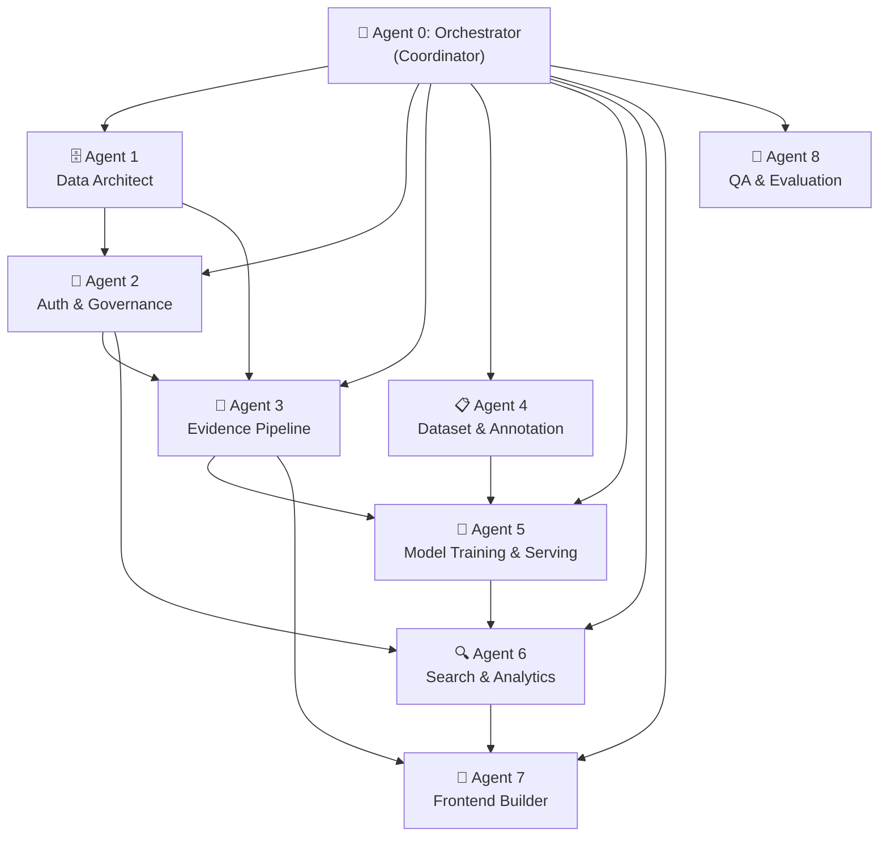

# SkillPulse: Complete Multi-Agent Implementation Plan

**Date:** 29 September 2026
**Approach:** 8 specialized custom AI agents + 1 orchestrator
**AI Strategy:** Custom-trained DistilBERT/MiniLM models (no external API dependency)
**Training Hardware:** NVIDIA GTX 1650 (4 GB VRAM, CUDA, Turing)

---

## 1. The Big Picture

SkillPulse is a multi-college university talent intelligence platform. We build it using a **team of 8 specialized custom agents**, each owning a distinct domain. An **Orchestrator** coordinates the sequence, manages shared contracts, and ensures integration.



### Why Custom-Trained Models Instead of an API

| Factor | External API (Gemini, OpenAI) | Our Custom BERT/RoBERTa |
|---|---|---|
| **Privacy** | Student data leaves your server | Data never leaves your infrastructure |
| **Cost** | Per-token pricing, quota limits | Free after one-time training |
| **Offline** | Requires internet at all times | Works fully offline |
| **Control** | Black box, provider can change behavior | You own the weights, reproducible |
| **CPU Speed** | Network latency + remote processing | ~50–200 ms local inference |
| **Research Value** | "We called an API" | "We trained and evaluated task-specific models" — publishable |
| **Specialization** | General-purpose 100B+ param LLM | Fine-tuned on YOUR taxonomy and evidence types |
| **Size** | Cannot run locally | ~66–110 M params, runs on any laptop |

---

## 2. Tech Stack

| Layer | Technology | Rationale |
|---|---|---|
| **Frontend** | Next.js 15+ (React, TypeScript) | SSR, API routes, type safety |
| **Backend API** | Next.js API Routes (REST) | Collocated with frontend, simple |
| **Database** | PostgreSQL + Prisma ORM | Relational model fits the evidence graph; Prisma gives type-safe queries and migrations |
| **Auth** | NextAuth.js / Auth.js | Role-based access, session management, SSO-ready |
| **ML Framework** | PyTorch + Hugging Face Transformers | Best ecosystem for BERT fine-tuning |
| **ML Training** | GTX 1650 (4 GB VRAM) + CUDA + mixed precision (FP16) | 6–8× faster than CPU training |
| **ML Inference** | ONNX Runtime (quantized INT8) on CPU | 2–5× faster than raw PyTorch; no GPU needed at runtime |
| **ML Server** | FastAPI | Lightweight Python server for model inference |
| **File Storage** | Local filesystem / S3-compatible (MinIO for dev) | Private evidence file storage |
| **Search** | PostgreSQL full-text search (MVP) | Start simple, upgrade to Meilisearch later |

### System Architecture

```
┌─────────────────────────────────────────────────────────────────┐
│                        BROWSER                                  │
│              Next.js React Frontend                             │
└──────────────────────┬──────────────────────────────────────────┘
                       │ HTTPS
┌──────────────────────▼──────────────────────────────────────────┐
│                  NEXT.JS SERVER                                 │
│  ┌────────────┐ ┌────────────┐ ┌────────────┐ ┌─────────────┐  │
│  │ Auth       │ │ Evidence   │ │ Search     │ │ Analytics   │  │
│  │ Middleware │ │ API Routes │ │ API Routes │ │ API Routes  │  │
│  └─────┬──────┘ └─────┬──────┘ └─────┬──────┘ └──────┬──────┘  │
│        │              │              │               │          │
│  ┌─────▼──────────────▼──────────────▼───────────────▼──────┐  │
│  │              Prisma ORM + RBAC + Audit Layer              │  │
│  └──────────────────────┬────────────────────────────────────┘  │
└─────────────────────────┼───────────────────────────────────────┘
                          │                    ┌──────────────────┐
                          │   HTTP (localhost)  │  FASTAPI ML      │
                          │ ◄─────────────────►│  SERVER           │
                          │                    │  ┌────────────┐  │
                          │                    │  │ NER Model  │  │
                          │                    │  │ Mapper     │  │
                          │                    │  │ Parser     │  │
                          │                    │  └────────────┘  │
               ┌──────────▼──────────┐         └──────────────────┘
               │    PostgreSQL       │
               │    + File Storage   │
               └─────────────────────┘
```

---

## 3. The 3 Custom Models We Train

### Model 1: SkillExtractor — Named Entity Recognition

**Purpose:** Extract structured fields (skills, technologies, issuers, dates, roles, achievements) from unstructured evidence text.

**Base model:** `distilbert-base-uncased` (66M params) — 40% smaller than full BERT, fits comfortably in 4 GB VRAM, only ~3% accuracy drop.

**Task:** Token classification with BIO tagging.

**Entity tags:**

| Tag | Example | From text |
|---|---|---|
| `B-SKILL` / `I-SKILL` | "machine learning" | "Built a **machine learning** model for…" |
| `B-TECH` / `I-TECH` | "React", "PostgreSQL" | "Developed using **React** and **PostgreSQL**" |
| `B-ISSUER` / `I-ISSUER` | "Coursera" | "Certificate issued by **Coursera**" |
| `B-DATE` / `I-DATE` | "March 2026" | "Completed in **March 2026**" |
| `B-ROLE` / `I-ROLE` | "team lead" | "Served as **team lead** for the project" |
| `B-ACHIEVEMENT` / `I-ACHIEVEMENT` | "first place" | "Won **first place** in hackathon" |
| `O` | everything else | Non-entity tokens |

**Training data format:**

```json
{
  "tokens": ["Built", "a", "machine", "learning", "model", "using", "Python", "and", "TensorFlow"],
  "ner_tags": ["O", "O", "B-SKILL", "I-SKILL", "O", "O", "B-TECH", "O", "B-TECH"]
}
```

**Training config (GTX 1650 optimized):**

```yaml
base_model: distilbert-base-uncased   # 66M params — fits in 4 GB VRAM
task: token_classification
num_labels: 13                        # BIO tags for 6 entity types + O
learning_rate: 5e-5
batch_size: 16                        # fits in 4 GB with FP16
epochs: 10
max_seq_length: 256
optimizer: AdamW
weight_decay: 0.01
warmup_ratio: 0.1
fp16: true                            # mixed precision — 2× faster, halves VRAM
evaluation_strategy: epoch
metric: seqeval_f1
estimated_training_time: 45-70 min     # on GTX 1650
```

**Target metrics:**
- F1 ≥ 0.80 for SKILL and TECH entities
- F1 ≥ 0.75 for ISSUER and DATE entities
- Precision ≥ 0.85 (wrong extractions are worse than missed ones)

---

### Model 2: SkillMapper — Semantic Similarity

**Purpose:** Map extracted free-text skill mentions to canonical skill IDs in the taxonomy. Handles abbreviations ("ML" → "Machine Learning"), variations ("React.js" → "React"), and near-synonyms.

**Base model:** `sentence-transformers/all-MiniLM-L6-v2` (22M params — very fast on CPU).

**Task:** Encode extracted skill text into a 384-dim embedding, then find the closest canonical skill by cosine similarity.

**How it works:**

```
Input:  "machine learning"
         ↓
Encode to 384-dim embedding
         ↓
Cosine similarity against all pre-computed taxonomy embeddings
         ↓
Output: { canonical_id: "SKILL_042", canonical_label: "Machine Learning", similarity: 0.94 }
```

**Training approach:** Contrastive learning with positive/negative skill pairs.

```json
[
  {"text": "machine learning", "canonical": "Machine Learning", "label": 1},
  {"text": "ML",               "canonical": "Machine Learning", "label": 1},
  {"text": "deep learning",    "canonical": "Deep Learning",    "label": 1},
  {"text": "machine learning", "canonical": "Web Development",  "label": 0},
  {"text": "React.js",         "canonical": "React",            "label": 1},
  {"text": "React.js",         "canonical": "Nuclear Physics",  "label": 0}
]
```

**Training config (GTX 1650 optimized):**

```yaml
base_model: sentence-transformers/all-MiniLM-L6-v2  # 22M params — tiny, ~1.5 GB VRAM
task: contrastive_learning
loss: MultipleNegativesRankingLoss
learning_rate: 2e-5
batch_size: 64                                       # plenty of VRAM headroom
epochs: 5
warmup_steps: 100
fp16: true
metric: accuracy_at_1
estimated_training_time: 10-20 min                   # on GTX 1650
```

**Target metrics:**
- Top-1 accuracy ≥ 0.85 (correct skill is the closest match)
- Top-3 accuracy ≥ 0.95 (correct skill is in the top 3)
- Returns "no match" for out-of-taxonomy skills ≥ 0.80

---

### Model 3: QueryParser — Intent Classification + Slot Filling

**Purpose:** Convert natural language search queries into structured API filters.

**Base model:** `distilbert-base-uncased` (66M params) — same as SkillExtractor for consistency and VRAM fit.

**Task:** Joint intent classification (from `[CLS]` token) + slot filling (token-level BIO tags).

**Examples:**

```
Input:  "students who know React and have a verified ML project in CS department"
Output: {
  "intent": "STUDENT_SEARCH",
  "slots": {
    "skills": ["React", "Machine Learning"],
    "evidence_type": "PROJECT",
    "workflow_state": "APPROVED",
    "department": "Computer Science"
  }
}

Input:  "show me certificates uploaded this semester"
Output: {
  "intent": "EVIDENCE_SEARCH",
  "slots": {
    "evidence_type": "CERTIFICATE",
    "date_range": "CURRENT_SEMESTER"
  }
}
```

**Architecture — dual head on BERT:**

```
              Input Query Text
                    ↓
             ┌────────────┐
             │ BERT Encoder│
             └──────┬─────┘
                    │
         ┌──────────┴──────────┐
         ↓                      ↓
  ┌──────────────┐     ┌───────────────┐
  │ Intent Head   │     │  Slot Head     │
  │ CLS → class   │     │ Token → tags   │
  └──────────────┘     └───────────────┘
         ↓                      ↓
  "STUDENT_SEARCH"     skills:[React,ML]
                       dept:[CS]
                       state:[APPROVED]
```

**Training config (GTX 1650 optimized):**

```yaml
base_model: distilbert-base-uncased   # 66M params — fits in 4 GB VRAM
task: joint_intent_slot
num_intents: 5       # STUDENT_SEARCH, EVIDENCE_SEARCH, SKILL_SEARCH, ANALYTICS, GENERAL
num_slot_labels: 11  # BIO tags for skill, dept, college, evidence_type, date_range
learning_rate: 3e-5
batch_size: 16
epochs: 15
max_seq_length: 128
intent_loss_weight: 0.3
slot_loss_weight: 0.7
fp16: true                            # mixed precision
metric: joint_accuracy
estimated_training_time: 50-80 min     # on GTX 1650
```

**Target metrics:**
- Intent accuracy ≥ 0.90
- Slot F1 ≥ 0.80
- Joint accuracy (intent + all slots correct) ≥ 0.75

---

## 4. The 8 Agents — Detailed Breakdown

---

### Agent 0: 🧠 Orchestrator (The Coordinator)

**Role:** Sequences all agents, manages dependencies, creates shared contracts, resolves conflicts.

**What it does:**
- Defines the build order and dependency graph
- Creates shared TypeScript types and Python schemas before agents start
- Reviews each agent's output for compatibility
- Triggers integration testing after each phase
- Manages project-wide config (`.env`, `prisma schema`, `package.json`, `requirements.txt`)

**Implementation:** This is you (the developer) plus Antigravity acting as coordinator. You invoke each agent with precise instructions, shared context, and interface contracts.

**Build order:**

```
Phase 0 ─── Agent 4 (Dataset & Annotation)     ← Can start immediately
Phase 1 ─── Agent 1 (Data Architect)            ← Parallel with Phase 0
Phase 2 ─── Agent 2 (Auth & Governance)          ← Depends on Phase 1
Phase 3 ─┬─ Agent 3 (Evidence Pipeline)          ← Parallel
          ├─ Agent 5 (Model Training & Serving)  ← Parallel (needs Phase 0)
Phase 4 ─── Agent 6 (Search & Analytics)         ← Depends on 3 + 5
Phase 5 ─── Agent 7 (Frontend Builder)           ← Depends on all APIs
Phase 6 ─── Agent 8 (QA & Evaluation)            ← End-to-end validation
```

---

### Agent 1: 🗄️ Data Architect

**Role:** Designs and implements the complete database schema, seed data, and data access layer.

**Responsibilities:**

| Task | Details |
|---|---|
| Schema design | Full Prisma schema with all 25+ core entities from the research doc |
| Relationships | University → College → Department → Program → Cohort hierarchy; Student ↔ Evidence ↔ Skills graph |
| Provenance fields | Every record gets: `sourceType`, `sourceId`, `createdAt`, `updatedAt`, `importedAt`, `visibilityScope`, `lifecycleState` |
| Seed data | Realistic demo data: 2 colleges, 4 departments, 50 students, 200 evidence items, 100+ skills |
| Migrations | Prisma migrations with rollback strategy |
| Data access layer | Type-safe repository pattern for each entity |

**Core entities:**

```
University, College, Department, Program, Cohort,
User, ScopedRole, StudentProfile, AcademicFact,
EvidenceItem, Project, Contribution, Credential,
Achievement, Activity, Skill, SkillAlias, SkillClaim,
SkillEvidence, VerificationAction, AuditEvent,
CareerRole, CareerRequirement, CareerProfile,
Opportunity, StudentOptIn
```

**Key schema (simplified):**

```prisma
model University {
  id        String    @id @default(cuid())
  name      String
  colleges  College[]
}

model College {
  id           String       @id @default(cuid())
  universityId String
  university   University   @relation(fields: [universityId], references: [id])
  departments  Department[]
}

model Student {
  id             String          @id @default(cuid())
  userId         String          @unique
  departmentId   String
  enrollmentNo   String          @unique
  profile        StudentProfile?
  evidenceItems  EvidenceItem[]
  skillClaims    SkillClaim[]
  careerProfile  CareerProfile?
}

model EvidenceItem {
  id            String        @id @default(cuid())
  studentId     String
  type          EvidenceType
  title         String
  description   String?
  dateObtained  DateTime
  issuerName    String?
  fileUrl       String?
  externalUrl   String?
  sourceType    SourceType
  workflowState WorkflowState
  skillClaims   SkillClaim[]
  reviews       VerificationAction[]
}

model Skill {
  id             String       @id @default(cuid())
  canonicalLabel String       @unique
  category       String
  definition     String?
  aliases        SkillAlias[]
  claims         SkillClaim[]
}

model SkillClaim {
  id                 String   @id @default(cuid())
  studentId          String
  skillId            String
  evidenceId         String?
  sourceType         SourceType
  isAiSuggested      Boolean  @default(false)
  confirmedByStudent Boolean  @default(false)
  freshness          DateTime?
}

model VerificationAction {
  id         String         @id @default(cuid())
  evidenceId String
  reviewerId String
  decision   ReviewDecision
  reason     String
  reviewedAt DateTime       @default(now())
}
```

**Deliverables:**
- `prisma/schema.prisma` — Complete schema
- `prisma/seed.ts` — Realistic demo data generator
- `src/lib/db/` — Repository pattern data access layer
- `src/types/` — Shared TypeScript types and enums

**Success criteria:**
- All 25+ entities from Section 9.2 of the research doc are modeled
- Every record has provenance fields
- University → College → Department hierarchy enforced
- Demo seed creates realistic multi-college data
- Schema validates and generates clean migrations

---

### Agent 2: 🔐 Auth & Governance

**Role:** Implements authentication, RBAC, college-scoped permissions, audit logging, and privacy controls.

**Responsibilities:**

| Task | Details |
|---|---|
| Authentication | NextAuth.js with credential provider (MVP); SSO-ready architecture |
| Role system | 6 roles: `STUDENT`, `FACULTY_REVIEWER`, `DEPT_ADMIN`, `UNIVERSITY_ADMIN`, `PLACEMENT_STAFF`, `PARTNER` |
| Scope enforcement | Every API call checks role + college/department scope; a dept admin in College A cannot see College B students |
| Audit logging | Log every sensitive action: review decision, search, export, sharing, data access |
| Privacy controls | Student visibility settings per evidence item; external sharing with expiry/revocation |
| Middleware | Server-side auth middleware that injects user context + scope into every request |

**Role-permission matrix:**

```
┌────────────────────┬────────┬──────────┬──────────┬──────────┬───────────┬─────────┐
│ Action             │ STUDENT│ FACULTY  │ DEPT_ADM │ UNI_ADM  │ PLACEMENT │ PARTNER │
├────────────────────┼────────┼──────────┼──────────┼──────────┼───────────┼─────────┤
│ Submit evidence    │   ✅   │    ❌    │    ❌    │    ❌    │     ❌    │   ❌    │
│ Edit own profile   │   ✅   │    ❌    │    ❌    │    ❌    │     ❌    │   ❌    │
│ Review evidence    │   ❌   │    ✅    │    ✅    │    ✅    │     ❌    │   ❌    │
│ Search students    │   ❌   │  Dept    │  Dept    │  All     │  Opt-in   │ Shared  │
│ View aggregates    │   ❌   │  Dept    │  Dept    │  All     │  Opt-in   │   ❌    │
│ Manage taxonomy    │   ❌   │    ❌    │    ✅    │    ✅    │     ❌    │   ❌    │
│ Export data        │  Own   │    ❌    │  Dept    │  All     │     ❌    │   ❌    │
│ View CGPA/attend.  │  Own   │  Dept    │  Dept    │  Scope   │     ❌    │   ❌    │
│ Share externally   │   ✅   │    ❌    │    ❌    │    ❌    │     ❌    │   ❌    │
└────────────────────┴────────┴──────────┴──────────┴──────────┴───────────┴─────────┘
```

**Deliverables:**
- `src/lib/auth/` — NextAuth config, session types, role types
- `src/middleware.ts` — Route protection + scope injection
- `src/lib/auth/rbac.ts` — Permission checker with scope validation
- `src/lib/audit/` — Audit event logger
- `src/app/api/auth/` — Auth API routes
- Login and registration pages with role selection

**Success criteria:**
- No API endpoint returns data outside the user's authorized scope
- Every review, search, export, and sharing action is logged
- Students can set per-item visibility (private, department, university, shared)
- Demo login works for all 6 roles with pre-seeded accounts

---

### Agent 3: 📄 Evidence Pipeline

**Role:** Builds the complete evidence submission → review → approval workflow.

**Responsibilities:**

| Task | Details |
|---|---|
| Submission flow | Student uploads project/certificate/achievement with a structured form |
| File handling | Upload, validate (type/size), store privately, generate time-bound access URLs |
| Workflow engine | State machine: Draft → Submitted → Pending Review → Approved / Rejected / Needs Clarification |
| Review queue | Faculty sees scoped queue sorted by date; can approve/reject/clarify with mandatory reason |
| Correction flow | Student can edit rejected items and resubmit; reviewer sees full history |
| Provenance tracking | Every state change recorded with who, when, why |

**State machine:**

```
                    ┌──────────────────────────────────────────┐
                    │              (student corrects            │
                    │               and resubmits)             │
    ┌───────┐   ┌───┴────┐   ┌─────────────┐   ┌──────────┐  │
    │ DRAFT ├──►│SUBMITTED├──►│PENDING_REVIEW├──►│ APPROVED │  │
    └───────┘   └────────┘   └──────┬───────┘   └──────────┘  │
                                    │                          │
                              ┌─────▼──────┐                   │
                              │  REJECTED  ├───────────────────┘
                              └─────┬──────┘
                                    │
                              ┌─────▼──────────────┐
                              │NEEDS_CLARIFICATION │
                              └────────────────────┘
```

**API endpoints:**

```
POST   /api/evidence              — Submit new evidence
GET    /api/evidence/:id          — Get evidence details (scoped)
PATCH  /api/evidence/:id          — Update (only if DRAFT or REJECTED)
DELETE /api/evidence/:id          — Soft delete (audit trail preserved)
POST   /api/evidence/:id/submit   — Move from DRAFT to SUBMITTED
GET    /api/review/queue          — Get reviewer's pending items (scoped)
POST   /api/review/:id/decide     — Approve / Reject / Clarify with reason
GET    /api/evidence/:id/history  — Full provenance trail
POST   /api/evidence/:id/upload   — File upload endpoint
```

**Deliverables:**
- `src/lib/evidence/` — Evidence service, state machine, file handler
- `src/app/api/evidence/` — All evidence API routes
- `src/app/api/review/` — Review queue and decision API routes
- Evidence submission form components
- Review queue UI components
- Provenance timeline component

**Success criteria:**
- A student can submit a project with file + metadata
- Workflow state transitions are enforced (cannot skip states)
- Reviewer sees only their scoped items
- Every state change has a provenance record (who, when, why)
- Files are validated and stored privately
- Rejected items show reason and allow correction + resubmission

---

### Agent 4: 📋 Dataset & Annotation

**Role:** Creates all labeled training datasets needed by Agent 5. This agent must run before model training begins.

**Responsibilities:**

| Task | Details |
|---|---|
| Skill taxonomy | Build the canonical skill catalog (200+ skills with IDs, categories, definitions, aliases) |
| Synthetic data generation | Template-based generation of evidence text with automatic BIO tags |
| Public dataset curation | Collect and adapt relevant open datasets (SkillSpan, job postings, GitHub READMEs) |
| Annotation guidelines | Write clear labeling instructions for each entity type |
| Manual annotation | Label a gold-standard evaluation set (100–200 real or realistic examples, 2 annotators) |
| Quality assurance | Compute inter-annotator agreement (Cohen's κ ≥ 0.75), adjudicate disagreements |
| Query dataset | Create labeled natural-language search queries with intent + slot annotations |
| Skill pair dataset | Build positive/negative pairs for contrastive skill-mapping training |

**Dataset size requirements:**

| Model | Minimum | Recommended | Format |
|---|---|---|---|
| SkillExtractor (NER) | 500 texts | 1,500–2,000 | BIO-tagged JSON |
| SkillMapper (similarity) | 200 pairs | 1,000+ pairs | (text, canonical, label) triples |
| QueryParser (intent+slot) | 300 queries | 800–1,000 | Intent label + BIO-tagged slots |

**Data sources:**

```
SOURCE 1: Synthetic Generation
  Templates with variation:
  "Built a {project_type} using {tech1} and {tech2}"
  "Certificate in {skill} from {issuer} on {date}"
  "Won {position} in {event_name} hackathon"
  → Generate 500–1,000 examples as starting base

SOURCE 2: Public Datasets
  - SkillSpan dataset (NER for skills in job postings)
  - ESCOXLM-R dataset (ESCO skill classification)
  - GitHub README descriptions → tech/skill extraction
  - Job posting skill requirements → taxonomy pairs

SOURCE 3: Manual Annotation (Gold Standard)
  - Collect 100–200 realistic student submissions
  - 2 annotators label independently
  - Compute inter-annotator agreement (Cohen's κ ≥ 0.75)
  - Adjudicate disagreements
  - This becomes the test set for final evaluation
```

**Annotation guidelines excerpt:**

```
SKILL tags:
  ✅ "machine learning", "data analysis", "project management"
  ✅ Domain knowledge: "signal processing", "database design"
  ❌ NOT technologies (tag as TECH): "Python", "React"
  ❌ NOT vague: "good at computers"

TECH tags:
  ✅ Programming languages: "Python", "Java", "C++"
  ✅ Frameworks/libraries: "React", "Django", "TensorFlow"
  ✅ Tools: "Docker", "Git", "Figma"
  ❌ NOT skills: "web development" (tag as SKILL)

Rules:
  - BIO format: "machine learning" → B-SKILL I-SKILL
  - Do not tag skills only mentioned in passing
    ("unlike machine learning approaches" → do NOT tag ML)
  - When unsure, tag as O and flag for review
```

**Deliverables:**
- `data/taxonomy/skills_catalog.json` — Canonical skill catalog
- `data/raw/` — Collected raw text samples
- `data/annotated/ner_train.json`, `ner_val.json`, `ner_test.json` — BIO-tagged NER data
- `data/skill_pairs/train.json`, `val.json` — Skill mapping pairs
- `data/queries/train.json`, `val.json`, `test.json` — Intent + slot labeled queries
- `docs/annotation_guidelines.md` — Labeling instructions
- `scripts/generate_synthetic.py` — Synthetic data generator
- `scripts/compute_iaa.py` — Inter-annotator agreement calculator

**Success criteria:**
- Skill catalog covers ≥ 200 skills across all relevant departments
- NER dataset has ≥ 1,000 annotated examples
- Inter-annotator agreement (κ) ≥ 0.75 on the gold-standard set
- All splits are stratified (train 80%, val 10%, test 10%)
- Data format is compatible with Hugging Face Datasets library

---

### Agent 5: 🧠 Model Training & Serving

**Role:** Trains the 3 custom NLP models, evaluates them, exports to ONNX, and serves via FastAPI.

**Responsibilities:**

| Task | Details |
|---|---|
| Train SkillExtractor | Fine-tune DistilBERT for NER on GTX 1650 with FP16 (~45–70 min) |
| Train SkillMapper | Fine-tune MiniLM with contrastive learning on GTX 1650 (~10–20 min) |
| Train QueryParser | Fine-tune DistilBERT with joint intent + slot heads on GTX 1650 (~50–80 min) |
| Evaluate all models | Report precision, recall, F1 per entity type; accuracy for mapper and parser |
| ONNX export | Convert all 3 GPU-trained models to ONNX + INT8 quantization for CPU deployment |
| FastAPI server | Build inference endpoints for all 3 models (CPU inference, no GPU needed) |
| Safety boundary | All outputs labeled as suggestions; schema validation on every response |
| Benchmark | Measure CPU inference latency for each model |

**ML project structure:**

```
skillpulse-models/
├── data/                          (from Agent 4)
│   ├── taxonomy/skills_catalog.json
│   ├── annotated/
│   ├── skill_pairs/
│   └── queries/
├── models/
│   ├── skill_extractor/
│   │   ├── train.py
│   │   ├── evaluate.py
│   │   ├── export_onnx.py
│   │   └── config.yaml
│   ├── skill_mapper/
│   │   ├── train.py
│   │   ├── evaluate.py
│   │   ├── export_onnx.py
│   │   └── config.yaml
│   └── query_parser/
│       ├── train.py
│       ├── evaluate.py
│       ├── export_onnx.py
│       └── config.yaml
├── serving/
│   ├── app.py                     (FastAPI server)
│   ├── models/                    (ONNX model files)
│   │   ├── skill_extractor.onnx
│   │   ├── skill_mapper.onnx
│   │   └── query_parser.onnx
│   ├── inference/
│   │   ├── extractor.py
│   │   ├── mapper.py
│   │   └── parser.py
│   └── requirements.txt
├── scripts/
│   ├── generate_synthetic.py
│   ├── prepare_data.py
│   ├── compute_iaa.py
│   └── benchmark.py
├── notebooks/
│   ├── 01_data_exploration.ipynb
│   ├── 02_training_analysis.ipynb
│   └── 03_error_analysis.ipynb
└── requirements.txt
```

**Training script example (SkillExtractor — GTX 1650 optimized):**

```python
# models/skill_extractor/train.py

import torch
from transformers import (
    AutoTokenizer,
    AutoModelForTokenClassification,
    TrainingArguments,
    Trainer,
    DataCollatorForTokenClassification,
)
from datasets import load_dataset
import evaluate

# Verify GPU is available
print(f"CUDA available: {torch.cuda.is_available()}")
print(f"GPU: {torch.cuda.get_device_name(0)}")
print(f"VRAM: {torch.cuda.get_device_properties(0).total_mem / 1e9:.1f} GB")

label_list = [
    "O",
    "B-SKILL", "I-SKILL",
    "B-TECH",  "I-TECH",
    "B-ISSUER","I-ISSUER",
    "B-DATE",  "I-DATE",
    "B-ROLE",  "I-ROLE",
    "B-ACHIEVEMENT", "I-ACHIEVEMENT",
]

dataset = load_dataset("json", data_files={
    "train":      "data/annotated/ner_train.json",
    "validation": "data/annotated/ner_val.json",
    "test":       "data/annotated/ner_test.json",
})

# DistilBERT — 66M params, fits in 4 GB VRAM with FP16
model_name = "distilbert-base-uncased"
tokenizer  = AutoTokenizer.from_pretrained(model_name)
model      = AutoModelForTokenClassification.from_pretrained(
    model_name, num_labels=len(label_list)
)

training_args = TrainingArguments(
    output_dir="./checkpoints/skill_extractor",
    num_train_epochs=10,
    per_device_train_batch_size=16,     # fits in 4 GB with FP16
    per_device_eval_batch_size=32,
    learning_rate=5e-5,
    weight_decay=0.01,
    warmup_ratio=0.1,
    fp16=True,                          # mixed precision — 2× faster, halves VRAM
    eval_strategy="epoch",
    save_strategy="epoch",
    load_best_model_at_end=True,
    metric_for_best_model="f1",
    dataloader_num_workers=2,           # parallel data loading
    gradient_accumulation_steps=1,      # increase to 2 if OOM
)

trainer = Trainer(
    model=model,
    args=training_args,
    train_dataset=tokenized_train,
    eval_dataset=tokenized_val,
    tokenizer=tokenizer,
    data_collator=DataCollatorForTokenClassification(tokenizer),
    compute_metrics=compute_ner_metrics,
)

trainer.train()  # ~45-70 min on GTX 1650
trainer.evaluate(tokenized_test)
```

**ONNX export + quantization (trained on GPU → deployed on CPU):**

```python
# models/skill_extractor/export_onnx.py
# Train on GTX 1650, export to ONNX, deploy on CPU — no GPU needed at runtime

from optimum.onnxruntime import ORTModelForTokenClassification, ORTQuantizer
from optimum.onnxruntime import AutoQuantizationConfig

# Export the GPU-trained model to ONNX (CPU-compatible)
ort_model = ORTModelForTokenClassification.from_pretrained(
    "./checkpoints/skill_extractor/best", export=True
)
ort_model.save_pretrained("./serving/models/skill_extractor_onnx")

# Quantize to INT8 for even faster CPU inference (~30-80 ms per request)
quantizer = ORTQuantizer.from_pretrained(ort_model)
qconfig   = AutoQuantizationConfig.avx512_vnni(is_static=False)
quantizer.quantize(save_dir="./serving/models/skill_extractor_quantized")
```

**FastAPI model server:**

```python
# serving/app.py

from fastapi import FastAPI
from pydantic import BaseModel
from inference.extractor import SkillExtractorInference
from inference.mapper import SkillMapperInference
from inference.parser import QueryParserInference

app = FastAPI(title="SkillPulse ML Server", version="1.0.0")

# Load all models once at startup
extractor = SkillExtractorInference("models/skill_extractor_quantized")
mapper    = SkillMapperInference("models/skill_mapper_onnx")
parser    = QueryParserInference("models/query_parser_onnx")


class ExtractionRequest(BaseModel):
    text: str
    evidence_type: str

class ExtractionResponse(BaseModel):
    skills: list[dict]
    technologies: list[dict]
    issuer: str | None
    date: str | None
    roles: list[dict]
    achievements: list[dict]
    inference_time_ms: float

@app.post("/extract", response_model=ExtractionResponse)
async def extract_metadata(req: ExtractionRequest):
    return extractor.predict(req.text, req.evidence_type)


class MappingRequest(BaseModel):
    skill_texts: list[str]

class MappingResponse(BaseModel):
    mappings: list[dict]

@app.post("/map-skills", response_model=MappingResponse)
async def map_skills(req: MappingRequest):
    return mapper.predict(req.skill_texts)


class QueryRequest(BaseModel):
    query: str

class QueryResponse(BaseModel):
    intent: str
    filters: dict
    confidence: float

@app.post("/parse-query", response_model=QueryResponse)
async def parse_query(req: QueryRequest):
    return parser.predict(req.query)


@app.get("/health")
async def health():
    return {"status": "ok", "models_loaded": 3}
```

**Integration with Next.js:**

```typescript
// src/lib/ml/client.ts

const ML_SERVER_URL = process.env.ML_SERVER_URL || 'http://localhost:8000';

export async function extractMetadata(text: string, evidenceType: string) {
  const res = await fetch(`${ML_SERVER_URL}/extract`, {
    method: 'POST',
    headers: { 'Content-Type': 'application/json' },
    body: JSON.stringify({ text, evidence_type: evidenceType }),
  });
  if (!res.ok) throw new Error('ML extraction failed');
  return res.json();
}

export async function mapSkills(skillTexts: string[]) {
  const res = await fetch(`${ML_SERVER_URL}/map-skills`, {
    method: 'POST',
    headers: { 'Content-Type': 'application/json' },
    body: JSON.stringify({ skill_texts: skillTexts }),
  });
  if (!res.ok) throw new Error('ML skill mapping failed');
  return res.json();
}

export async function parseSearchQuery(query: string) {
  const res = await fetch(`${ML_SERVER_URL}/parse-query`, {
    method: 'POST',
    headers: { 'Content-Type': 'application/json' },
    body: JSON.stringify({ query }),
  });
  if (!res.ok) throw new Error('ML query parsing failed');
  return res.json();
}
```

**Safety boundary (same as before — models suggest, humans decide):**

```
Evidence text / search query
         ↓
Custom model inference (candidate JSON only)
         ↓
Schema validation + taxonomy lookup + confidence threshold
         ↓
Student correction and/or human reviewer
         ↓
Deterministic backend authorization, filters, and storage
```

**Deliverables:**
- `models/skill_extractor/` — Training, evaluation, export scripts
- `models/skill_mapper/` — Training, evaluation, export scripts
- `models/query_parser/` — Training, evaluation, export scripts
- `serving/app.py` — FastAPI server with all 3 endpoints
- `serving/inference/` — Inference wrappers for each model
- `serving/models/` — Exported ONNX model files
- `src/lib/ml/client.ts` — Next.js client for the ML server
- `docs/model_evaluation_report.md` — Full metrics report

**Success criteria:**
- SkillExtractor: F1 ≥ 0.80 for SKILL/TECH, precision ≥ 0.85
- SkillMapper: Top-1 accuracy ≥ 0.85, Top-3 ≥ 0.95
- QueryParser: Intent accuracy ≥ 0.90, Slot F1 ≥ 0.80
- All models: CPU inference < 200 ms
- All outputs labeled "AI Suggestion" — never auto-approved
- Invalid model responses caught and handled gracefully
- FastAPI server passes health check and benchmark tests

---

### Agent 6: 🔍 Search & Analytics

**Role:** Builds the explainable search engine and coverage-aware analytics dashboards.

**Responsibilities:**

| Task | Details |
|---|---|
| Structured search | Multi-filter: skills, evidence type, college, department, workflow state, date range |
| NL search | Natural language queries parsed by QueryParser model (Agent 5) into structured filters |
| Explainable results | Every match shows WHY: "Matched because: ✅ React (approved project), ✅ ML (verified certificate)" |
| Scope enforcement | Results never include students outside the searcher's authorized scope |
| Coverage analytics | Counts WITH denominators: "45 of 120 students have ≥1 approved evidence item" |
| Aggregates | Skills distribution, evidence status breakdown, review queue metrics — always with coverage context |

**Search result schema:**

```typescript
interface SearchResult {
  student: {
    id: string;
    name: string;
    department: string;
    college: string;
  };
  matchedCriteria: {
    criterion: string;         // "React"
    matched: boolean;
    evidenceType: string;      // "Approved Project"
    evidenceTitle: string;     // "E-commerce Platform"
    evidenceDate: string;
    provenanceLevel: string;   // "reviewer_approved"
  }[];
  unmatchedCriteria: string[]; // Skills searched but not found
  notConsidered: string[];     // Fields outside search scope
  coverageNote: string;        // "Profile has 3 of 5 sections populated"
}
```

**Dashboard example:**

```
┌─────────────────────────────────────────────────────┐
│  📊 Department Skill Coverage                       │
│                                                     │
│  React:     ████████░░░░  45/120 students (37.5%)   │
│  Python:    ██████████░░  82/120 students (68.3%)   │
│  ML/AI:     ████░░░░░░░░  28/120 students (23.3%)   │
│                                                     │
│  ⚠️ Coverage: 95/120 students have ≥1 evidence item │
│  📅 Period: Sep 2025 – Sep 2026                     │
│  🏫 Scope: Computer Science, College A              │
└─────────────────────────────────────────────────────┘
```

**Deliverables:**
- `src/lib/search/` — Search engine, query builder, result formatter
- `src/app/api/search/` — Search API with scope enforcement
- `src/app/api/analytics/` — Aggregate endpoints with coverage
- Search UI with filters + NL input + explainable results
- Analytics dashboard with coverage-aware charts

**Success criteria:**
- Search never returns results outside the user's scope
- Every result explains WHY it matched (evidence + provenance)
- Aggregates always show numerator, denominator, and coverage percentage
- NL queries are correctly parsed into structured filters
- "Not evidenced" is shown instead of "does not have this skill"

---

### Agent 7: 🎨 Frontend Builder

**Role:** Builds the complete web application UI — polished, responsive, role-aware.

**Responsibilities:**

| Task | Details |
|---|---|
| Design system | Dark mode, modern typography (Inter), glassmorphism, micro-animations |
| Role-based views | Different layouts and navigation for each role |
| Student dashboard | Profile, evidence list, skill graph, career pathway, sharing controls |
| Reviewer dashboard | Review queue, decision interface, provenance timeline |
| Admin dashboard | Analytics, coverage charts, taxonomy management, user management |
| Search interface | Multi-filter + NL search with explainable results |
| Evidence forms | Dynamic forms for projects, certificates, achievements with file upload |
| AI suggestion UI | Clear "Model suggests…" cards with accept/modify/reject controls |

**Page map:**

```
/                          → Landing / login
/dashboard                 → Role-based dashboard redirect
/student/profile           → Student's evidence-linked profile
/student/evidence/new      → Submit new evidence
/student/evidence/:id      → View evidence detail + provenance
/student/skills            → Skill map with evidence links
/student/career            → Career pathway + gap analysis
/student/passport          → Shareable talent passport builder
/reviewer/queue            → Review queue (scoped)
/reviewer/evidence/:id     → Review decision interface
/admin/analytics           → Coverage-aware analytics
/admin/taxonomy            → Skill taxonomy management
/admin/users               → User/role management
/search                    → Explainable talent search
/share/:token              → Public talent passport view (no login)
```

**UI/UX principles from research doc:**

| Principle | Implementation |
|---|---|
| Provenance is visible | Color-coded badges: 🟢 University Source, 🔵 Reviewer Approved, 🟡 Student Submitted, ⚪ AI Suggested |
| "Not evidenced" ≠ "Doesn't have" | Gray text: "No evidence recorded for this skill" |
| Student controls sharing | Per-item toggle + passport builder with expiry |
| AI is always labeled | Sparkle icon (✨) + "Model Suggestion" tag on all model outputs |
| Coverage context | Every aggregate shows "X of Y" not just "X" |

**Deliverables:**
- `src/app/` — All Next.js pages and layouts
- `src/components/` — Reusable component library
- `src/styles/` — Design system CSS
- Responsive layouts for all screen sizes
- Role-based navigation and route guards
- Micro-animations and transitions

**Success criteria:**
- Premium look and feel — dark mode, smooth animations, modern typography
- Every provenance level is visually distinct
- AI suggestions are unmistakably labeled as model outputs
- All aggregates show coverage context
- Responsive and accessible
- Role-appropriate views — students never see admin tools

---

### Agent 8: 🧪 QA & Evaluation

**Role:** Tests the entire system end-to-end, validates security, evaluates custom models, and builds the demo.

**Responsibilities:**

| Task | Details |
|---|---|
| Scope testing | Verify no API leaks data across college/department boundaries |
| Workflow testing | Test all evidence state transitions including edge cases |
| Model safety testing | Verify model suggestions are never auto-approved; test with adversarial inputs |
| Model evaluation | Run all 3 models against the gold-standard test set; report full metrics |
| Role testing | Test every API endpoint with every role — verify unauthorized access is blocked |
| E2E scenarios | Full workflow: student submits → model suggests → student corrects → reviewer approves → profile shows → staff searches |
| Evaluation framework | Build the measurement tools from Section 11 of the research doc |
| Demo script | Create a scripted walkthrough for hackathon presentation |

**Test scenarios:**

```
Scenario 1: Happy Path
  Student logs in → submits project → model extracts skills →
  student confirms suggestions → reviewer approves → profile updated →
  staff searches "React developers" → student appears with explanation

Scenario 2: Cross-Scope Isolation
  Dept admin from College A searches → MUST NOT see College B students
  Faculty reviewer in CS → MUST NOT see EE student evidence

Scenario 3: Model Safety
  Model suggests "Advanced Python" → profile shows "Model Suggestion: Python"
  (NOT "Verified: Advanced Python")
  Student rejects suggestion → it is removed entirely

Scenario 4: Student Agency
  Student sets evidence to "Private" → reviewer cannot see it
  Student rejects AI skill suggestion → removed from profile
  Student shares passport → employer sees ONLY selected items

Scenario 5: Adversarial Input
  Upload fake certificate text → model may extract data but
  it stays "PENDING_REVIEW" → reviewer must manually approve

Scenario 6: Model Failure
  Model returns malformed output → gracefully handled, user sees
  "Could not auto-extract. Please fill in manually."
```

**Model evaluation checklist:**

```
SkillExtractor:
  □ Entity-level F1 ≥ 0.80 for SKILL and TECH
  □ No hallucinated skills (precision is critical)
  □ Handles short / noisy input gracefully
  □ Inference time < 200 ms on CPU

SkillMapper:
  □ Top-1 accuracy ≥ 0.85
  □ Returns "no match" for out-of-taxonomy skills
  □ Handles abbreviations (ML → Machine Learning)
  □ Inference time < 50 ms per skill

QueryParser:
  □ Intent accuracy ≥ 0.90
  □ Slot F1 ≥ 0.80
  □ Handles unparseable queries gracefully
  □ Inference time < 100 ms
```

**Deliverables:**
- `tests/` — Unit, integration, and E2E test suites
- `tests/security/` — Scope and role violation tests
- `tests/model-safety/` — Model output validation tests
- `docs/model_evaluation_report.md` — Full metrics with error analysis
- `docs/demo-script.md` — Hackathon presentation walkthrough
- `docs/evaluation-framework.md` — Pilot measurement plan from Section 11

**Success criteria:**
- All MVP acceptance criteria from research doc Section 10 pass
- Zero scope violations across all test scenarios
- Model outputs never auto-populate "verified" or "approved" fields
- Demo script runs end-to-end without errors
- Evaluation report includes per-entity metrics, error examples, and latency benchmarks

---

## 5. Shared Contracts (Created Before Any Agent Starts)

All agents import from these shared definitions to ensure compatibility.

### TypeScript types (web app)

```typescript
// src/types/shared.ts

export enum Role {
  STUDENT            = 'STUDENT',
  FACULTY_REVIEWER   = 'FACULTY_REVIEWER',
  DEPT_ADMIN         = 'DEPT_ADMIN',
  UNIVERSITY_ADMIN   = 'UNIVERSITY_ADMIN',
  PLACEMENT_STAFF    = 'PLACEMENT_STAFF',
  PARTNER            = 'PARTNER',
}

export enum SourceType {
  UNIVERSITY_SYSTEM  = 'UNIVERSITY_SYSTEM',
  ISSUER_VERIFIED    = 'ISSUER_VERIFIED',
  REVIEWER_APPROVED  = 'REVIEWER_APPROVED',
  STUDENT_SUBMITTED  = 'STUDENT_SUBMITTED',
  EXTERNAL_URL       = 'EXTERNAL_URL',
  AI_SUGGESTED       = 'AI_SUGGESTED',
}

export enum WorkflowState {
  DRAFT               = 'DRAFT',
  SUBMITTED           = 'SUBMITTED',
  PENDING_REVIEW      = 'PENDING_REVIEW',
  APPROVED            = 'APPROVED',
  REJECTED            = 'REJECTED',
  NEEDS_CLARIFICATION = 'NEEDS_CLARIFICATION',
  REVOKED             = 'REVOKED',
  EXPIRED             = 'EXPIRED',
}

export enum EvidenceType {
  PROJECT      = 'PROJECT',
  CERTIFICATE  = 'CERTIFICATE',
  ACHIEVEMENT  = 'ACHIEVEMENT',
  PUBLICATION  = 'PUBLICATION',
  ACTIVITY     = 'ACTIVITY',
  CLUB_ROLE    = 'CLUB_ROLE',
  VOLUNTEERING = 'VOLUNTEERING',
}

export interface UserContext {
  userId: string;
  role: Role;
  universityId: string;
  collegeId?: string;
  departmentId?: string;
  scopes: string[];
}

export interface MLExtractionResult {
  skills: { text: string; confidence: number }[];
  technologies: { text: string; confidence: number }[];
  issuer: string | null;
  dateObtained: string | null;
  roles: { text: string; confidence: number }[];
  achievements: { text: string; confidence: number }[];
  inferenceTimeMs: number;
}

export interface MLSkillMapping {
  text: string;
  canonicalId: string | null;
  canonicalLabel: string | null;
  similarity: number;
}

export interface MLQueryParseResult {
  intent: string;
  filters: Record<string, string | string[]>;
  confidence: number;
}

export interface ExplainableSearchResult {
  studentId: string;
  studentName: string;
  department: string;
  college: string;
  matchedCriteria: {
    criterion: string;
    matched: boolean;
    evidenceType: string;
    evidenceTitle: string;
    evidenceDate: string;
    provenanceLevel: string;
  }[];
  unmatchedCriteria: string[];
  coverageNote: string;
}
```

### Python schemas (ML server)

```python
# serving/schemas.py

from pydantic import BaseModel

class ExtractionRequest(BaseModel):
    text: str
    evidence_type: str

class EntityResult(BaseModel):
    text: str
    confidence: float

class ExtractionResponse(BaseModel):
    skills: list[EntityResult]
    technologies: list[EntityResult]
    issuer: str | None
    date: str | None
    roles: list[EntityResult]
    achievements: list[EntityResult]
    inference_time_ms: float

class MappingRequest(BaseModel):
    skill_texts: list[str]

class SkillMappingResult(BaseModel):
    text: str
    canonical_id: str | None
    canonical_label: str | None
    similarity: float

class MappingResponse(BaseModel):
    mappings: list[SkillMappingResult]

class QueryRequest(BaseModel):
    query: str

class QueryResponse(BaseModel):
    intent: str
    filters: dict
    confidence: float
```

---

## 6. Execution Sequence — Step by Step

### Phase 0: Dataset Creation (Agent 4 — Dataset & Annotation)
**Duration: 3–5 hours · Can start immediately**

```
Step 0.1  Build canonical skill taxonomy (200+ skills)
Step 0.2  Write annotation guidelines for all entity types
Step 0.3  Create synthetic data generation templates
Step 0.4  Generate 500–1,000 synthetic NER training examples
Step 0.5  Curate public datasets (SkillSpan, job postings)
Step 0.6  Create skill-mapping pairs (1,000+ positive/negative)
Step 0.7  Create search query dataset (800+ labeled queries)
Step 0.8  Manual annotation of 100–200 gold-standard examples
Step 0.9  Compute inter-annotator agreement, adjudicate
Step 0.10 Split all datasets (80/10/10)
```

**Output:** All training, validation, and test datasets ready.

---

### Phase 1: Database Foundation (Agent 1 — Data Architect)
**Duration: 2–3 hours · Parallel with Phase 0**

```
Step 1.1  Initialize Next.js project with TypeScript
Step 1.2  Set up Prisma with PostgreSQL
Step 1.3  Design complete schema (25+ entities)
Step 1.4  Create migrations
Step 1.5  Build seed script with realistic demo data
Step 1.6  Create shared TypeScript types and enums
Step 1.7  Build repository/data access layer
```

**Output:** Working database with seeded data, type-safe access layer.

---

### Phase 2: Security Layer (Agent 2 — Auth & Governance)
**Duration: 2 hours · Depends on Phase 1**

```
Step 2.1  Configure NextAuth.js with credential provider
Step 2.2  Define role types and scope hierarchy
Step 2.3  Build RBAC middleware (server-side scope checks)
Step 2.4  Create audit event logger
Step 2.5  Build login/registration pages
Step 2.6  Create demo accounts for all 6 roles
Step 2.7  Test scope isolation
```

**Output:** Working auth with role-based access and audit logging.

---

### Phase 3: Core Services (Agents 3 + 5 in parallel)
**Duration: 4–6 hours**

```
Agent 3 (Evidence Pipeline):
  Step 3.1  Build evidence submission API
  Step 3.2  Implement workflow state machine
  Step 3.3  Build file upload/validation
  Step 3.4  Create review queue API
  Step 3.5  Build decision workflow (approve/reject/clarify)
  Step 3.6  Create provenance timeline

Agent 5 (Model Training & Serving):            ← Needs Phase 0 datasets
  Step 5.1  Fine-tune SkillExtractor (BERT NER)
  Step 5.2  Fine-tune SkillMapper (MiniLM contrastive)
  Step 5.3  Fine-tune QueryParser (BERT joint intent+slot)
  Step 5.4  Evaluate all 3 models on test sets
  Step 5.5  Export to ONNX + INT8 quantization
  Step 5.6  Build FastAPI inference server
  Step 5.7  Build Next.js ML client
  Step 5.8  Benchmark CPU inference latency
```

**Output:** Complete evidence workflow + trained and served custom models.

---

### Phase 4: Discovery Layer (Agent 6 — Search & Analytics)
**Duration: 2–3 hours · Depends on Phases 3**

```
Step 6.1  Build structured search with multi-filter
Step 6.2  Integrate NL query parsing from QueryParser model
Step 6.3  Create explainable result formatting
Step 6.4  Build coverage-aware aggregates
Step 6.5  Create analytics dashboard endpoints
Step 6.6  Add scope enforcement to all queries
```

**Output:** Explainable search + coverage-aware analytics.

---

### Phase 5: User Interface (Agent 7 — Frontend Builder)
**Duration: 4–5 hours · Depends on all APIs**

```
Step 7.1   Design system (tokens, typography, dark mode)
Step 7.2   Build component library (cards, badges, forms, charts)
Step 7.3   Student dashboard + profile
Step 7.4   Evidence submission forms
Step 7.5   AI suggestion confirmation UI (accept/modify/reject)
Step 7.6   Reviewer queue + decision interface
Step 7.7   Search interface with explainable results
Step 7.8   Analytics dashboard with coverage charts
Step 7.9   Talent passport builder + sharing
Step 7.10  Polish: animations, transitions, responsive design
```

**Output:** Complete, polished web application.

---

### Phase 6: Validation (Agent 8 — QA & Evaluation)
**Duration: 2–3 hours · End-to-end**

```
Step 8.1  Run full E2E workflow tests
Step 8.2  Test scope isolation across all roles
Step 8.3  Test model safety boundaries
Step 8.4  Evaluate all 3 models on gold-standard test set
Step 8.5  Validate all MVP acceptance criteria from Section 10
Step 8.6  Create demo script and walkthrough
Step 8.7  Build evaluation framework from Section 11
Step 8.8  Write model evaluation report
Step 8.9  Fix any issues found
```

**Output:** Validated, demo-ready system with full evaluation report.

---

## 7. How to Execute This Plan

### Option A: Sequential (Solo Developer + Antigravity)

Invoke each agent one at a time using focused prompts. Each prompt includes:
1. The shared types contract
2. The specific agent's deliverables and success criteria
3. The previous agents' outputs (file paths)

### Option B: Parallel (Multiple Antigravity Conversations)

Open separate conversations for agents that can run in parallel:
- Phase 0 (Dataset) + Phase 1 (Data Architect) run together
- Phase 3: Agent 3 (Evidence) + Agent 5 (Model Training) run together

### Recommended Prompt Template for Each Agent

```
You are acting as [Agent Name] for the SkillPulse project.

CONTEXT:
- Research doc: d:\SKIILL\SkillPulse_Research_Problem_Solution_Implementation_Report.md
- Shared types: src/types/shared.ts
- Previous agent outputs: [list file paths]

YOUR DELIVERABLES:
1. [Specific file/component 1]
2. [Specific file/component 2]
...

SUCCESS CRITERIA:
- [Criterion 1]
- [Criterion 2]
...

CONSTRAINTS:
- Use the shared types from src/types/shared.ts
- Follow the existing project structure
- Do not modify files owned by other agents
- [Agent-specific constraints]

BUILD NOW.
```

---

## 8. Total Estimated Effort

| Phase | Agent | Duration | Dependencies | Parallelizable With |
|---|---|---|---|---|
| Phase 0 | 📋 Dataset & Annotation | 3–5 hours | None | Phase 1 |
| Phase 1 | 🗄️ Data Architect | 2–3 hours | None | Phase 0 |
| Phase 2 | 🔐 Auth & Governance | 2 hours | Phase 1 | — |
| Phase 3a | 📄 Evidence Pipeline | 3–4 hours | Phase 1, 2 | Phase 3b |
| Phase 3b | 🧠 Model Training & Serving | 3–4 hours | Phase 0 | Phase 3a |
| Phase 4 | 🔍 Search & Analytics | 2–3 hours | Phase 3a, 3b | — |
| Phase 5 | 🎨 Frontend Builder | 4–5 hours | Phase 1–4 | — |
| Phase 6 | 🧪 QA & Evaluation | 2–3 hours | Phase 5 | — |
| **Total** | | **~21–29 hours** | | |

> With parallelization (Phase 0+1 and Phase 3a+3b), wall-clock time reduces to **~16–21 hours**.

### GTX 1650 Training Time Breakdown

| Model | Base | Params | VRAM Used | FP16 | Training Time |
|---|---|---|---|---|---|
| SkillExtractor | distilbert-base-uncased | 66M | ~2.5 GB | ✅ | ~45–70 min |
| SkillMapper | all-MiniLM-L6-v2 | 22M | ~1.5 GB | ✅ | ~10–20 min |
| QueryParser | distilbert-base-uncased | 66M | ~2.5 GB | ✅ | ~50–80 min |
| **Total GPU training** | | | | | **~2–3 hours** |

> All 3 models train sequentially on a single GTX 1650. After training, models are exported to ONNX and deployed on CPU — no GPU needed at runtime.

---

## 9. MVP Acceptance Checklist (from Research Doc Section 10)

- [ ] Role and college scope checked server-side for every student record
- [ ] Students cannot edit source-marked official facts directly
- [ ] Project/certificate linked to student and original file/source
- [ ] Model output visibly marked as suggestion and correctable
- [ ] Reviewer can approve/reject/clarify with mandatory reason
- [ ] Profile distinguishes: official source, reviewer-approved, student entry, model suggestion
- [ ] Skill claim opens the evidence that supports it
- [ ] Staff search reproducible with structured query + matched conditions shown
- [ ] Search never returns records outside current user's scope
- [ ] Aggregates show time period and record coverage
- [ ] External sharing not enabled by default
- [ ] Sample/demo data clearly labelled
- [ ] Implementation report states which features are actually complete

---

## 10. Research Contribution

By training custom models, this project delivers a publishable research contribution:

> "We designed, annotated, trained, and evaluated three task-specific NLP models for university student talent profiling:
>
> 1. A NER model for extracting skills and technologies from student evidence submissions
> 2. A semantic similarity model for mapping free-text skills to a canonical taxonomy
> 3. A joint intent-slot model for natural language talent search
>
> All models run on CPU with < 200 ms latency, require no external API, and keep all student data on-premises. We report precision, recall, F1, and inter-annotator agreement on a manually labeled evaluation set of university student evidence."

This is publishable research — far stronger than "we called an external API."

---

## 11. Risk Register (Updated for Custom Models)

| Risk | Consequence | Response |
|---|---|---|
| Insufficient training data | Models underperform targets | Synthetic generation + public datasets as bootstrap; iterate on annotation |
| Model accuracy below thresholds | Extracted skills are wrong or missing | Fallback to manual entry; show model confidence; lower threshold = more suggestions for human review |
| GTX 1650 VRAM overflow (OOM) | Training crashes mid-epoch | Reduce batch size to 8, increase gradient_accumulation_steps to 2; use DistilBERT (not full BERT) |
| Low student adoption | Profiles incomplete; analytics misleading | Immediate student benefit, minimize entry friction, co-design incentives |
| Review burden too high | Faculty abandon the tool | Scope review policies, measure time, allow trusted sources |
| Cross-college taxonomy mismatch | Aggregates are not comparable | Version canonical terms, map local terms, document uncertainty |
| Scope violation | Unauthorized data access | Server-side enforcement, comprehensive testing, audit logging |
| Model hallucination | Unsupported skills appear on profile | Suggest-only status, confidence threshold, student correction, reviewer queue |
| Overbuilt scope | Demo is broad but core flow unreliable | Ship one vertical slice; roadmap everything else |
